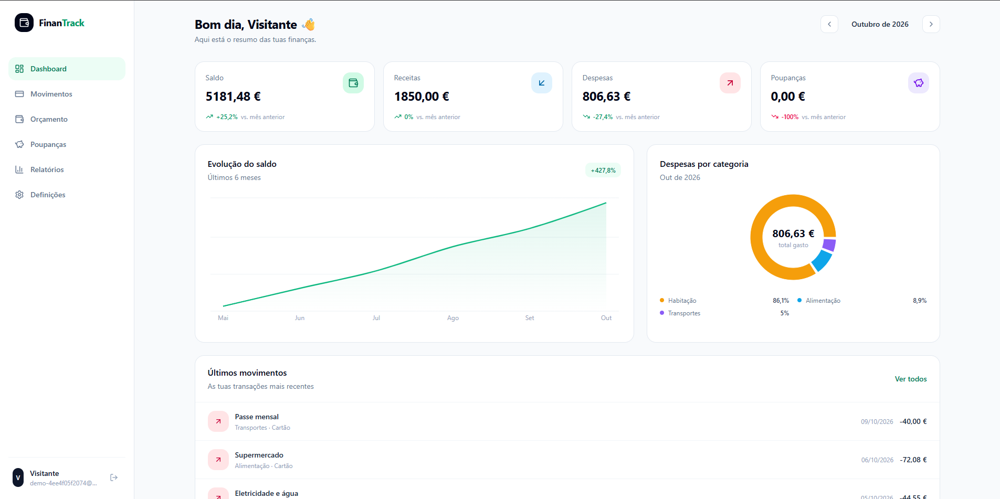
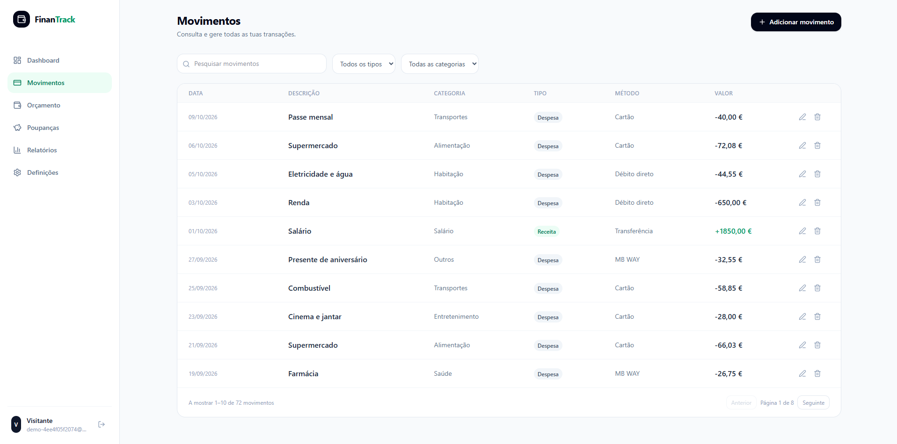
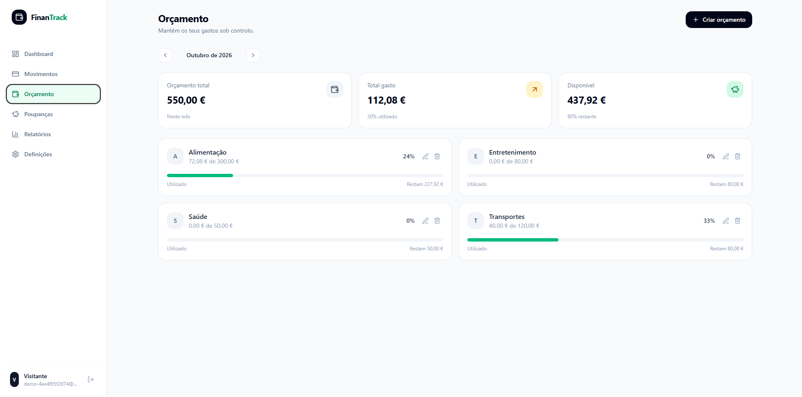
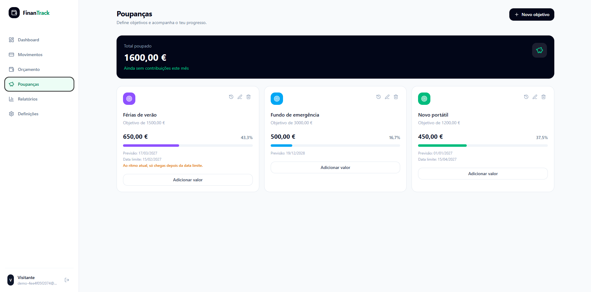

# FinanTrack

[](https://github.com/andreeemarques/FinanTrack/actions/workflows/ci.yml)

Gestor financeiro pessoal: regista receitas e despesas, define orçamentos mensais, acompanha objetivos de poupança e analisa a evolução das finanças.

Projeto de portefólio, com frontend, API, base de dados, testes automáticos, CI e deploy.

**🔗 [Experimentar a demonstração](https://finan-track-chi.vercel.app/demo)** (sem registo) · **📖 [Documentação da API](https://finantrack-2wje.onrender.com/documentacao)**

> ⏳ **Nota:** a API corre num plano gratuito que adormece após 15 minutos sem uso. O primeiro pedido pode demorar cerca de 1 minuto a acordar, e a aplicação avisa quando isso acontece.

## Capturas de ecrã

| Dashboard | Movimentos |
|---|---|
|  |  |
| **Orçamento** | **Poupanças** |
|  |  |

## Funcionalidades

- **Movimentos:** criar, editar e apagar receitas e despesas, com pesquisa, filtros por tipo e categoria, e paginação.
- **Orçamentos mensais** por categoria, com o gasto calculado em tempo real a partir dos movimentos, barra de progresso e aviso quando o limite é ultrapassado.
- **Objetivos de poupança** com histórico de contribuições e **previsão de conclusão** ao ritmo atual.
- **Dashboard:** saldo, receitas, despesas e poupança do mês com a variação face ao mês anterior, evolução do saldo nos últimos 6 meses e despesas por categoria.
- **Relatórios:** receitas vs. despesas por mês, média mensal de despesas, maior categoria, taxa de poupança, e **exportação para CSV** com totais.
- **Conta:** registo e login, alteração do nome, do email e da password, e eliminação da conta (com confirmação da password).
- **Demonstração:** cada visitante recebe uma conta temporária e isolada, com seis meses de dados de exemplo, apagada ao fim de 24 horas.
- **API documentada** com OpenAPI/Swagger.

## Tecnologias

| Camada | Tecnologias |
|---|---|
| **Frontend** | Next.js 16 (App Router), React 19, TypeScript, Tailwind CSS 4, TanStack Query, Recharts |
| **Backend** | NestJS, TypeScript, Prisma 7, JWT, bcrypt, class-validator, Swagger/OpenAPI, Helmet, Throttler |
| **Base de dados** | PostgreSQL |
| **Testes** | Vitest, Supertest (testes de integração contra um PostgreSQL real) |
| **CI/CD** | GitHub Actions (build, testes e auditoria de dependências), Dependabot |
| **Deploy** | Vercel (frontend), Render (API), Neon (PostgreSQL) |

A interface base foi gerada com o v0 da Vercel; a partir daí, foi refatorada em componentes, ligada à API real e estendida com autenticação, demonstração, definições e exportação.

## Arquitetura

```
Browser ──► Frontend (Next.js, Vercel)
               │  HTTPS + JWT (Bearer)
               ▼
            API REST (NestJS, Render) ──► PostgreSQL (Neon)
               │
               └─ /documentacao (Swagger)
```

Estrutura do repositório:

```
finan-track/
├── backend/            API NestJS
│   ├── prisma/         esquema e migrações
│   ├── src/
│   │   ├── autenticacao/   registo, login, conta e guard JWT
│   │   ├── categorias/ movimentos/ orcamentos/ objetivos/
│   │   ├── resumo/         agregações do dashboard e dos relatórios
│   │   ├── demo/           contas de demonstração
│   │   ├── comum/ config/ prisma/ saude/
│   └── test/           testes de integração
├── frontend/           aplicação Next.js
│   ├── app/            rotas: /, /entrar, /registar, /demo, /painel
│   ├── components/     ecrãs e componentes
│   └── lib/            cliente da API, sessão e hooks de dados
├── docs/imagens/       capturas de ecrã
├── docker-compose.yml  PostgreSQL local
└── .github/            CI e Dependabot
```

## Decisões técnicas

- **Dinheiro em cêntimos (inteiros).** Evita erros de arredondamento dos números decimais. O frontend converte ao mostrar e ao enviar.
- **Valores calculados, não guardados.** O gasto de um orçamento e o valor poupado de um objetivo são calculados a partir dos movimentos e das contribuições, por isso nunca ficam desatualizados.
- **Agregações em SQL.** O dashboard e os relatórios usam uma só query com `GROUP BY` para a série mensal, em vez de um ciclo por mês.
- **Testes contra uma base de dados real.** Os testes de integração usam um PostgreSQL de teste (e recusam correr noutra base de dados), porque é aí que estão os riscos: queries, relações e isolamento. Incluem as fronteiras de mês (último e primeiro dia).
- **Vitest em vez de Jest.** Os pacotes do Nest 12 são só ESM, e o Jest não os consegue carregar.
- **Nomes em português** no código, na API e na base de dados.

## Segurança

- Passwords com hash (bcrypt, custo 12) e mensagens de login genéricas, com o tempo de resposta igualado para não revelar que emails existem.
- **Isolamento entre utilizadores:** cada pedido é filtrado pelo utilizador autenticado, e o que pertence a outro dá `404`. Há testes automáticos que verificam isto em todas as áreas.
- Tokens JWT com **versão**: alterar a password invalida as outras sessões, e o guard confirma que a conta ainda existe (um token de uma conta apagada deixa de funcionar).
- Alterar o email, a password ou apagar a conta exige a **password atual**.
- Validação rigorosa dos dados (campos desconhecidos são rejeitados), **rate limiting** (mais apertado nas rotas de autenticação), cabeçalhos de segurança (Helmet), CORS limitado ao frontend e validação das variáveis de ambiente no arranque (a API recusa arrancar com um `JWT_SECRET` fraco).
- **Quotas por conta** e limites nas contas de demonstração (por IP, por hora e no total), para ninguém encher a base de dados.
- CI com auditoria de dependências e Dependabot.

## Limitações conhecidas

- O token fica no `localStorage`, o que o expõe a ataques XSS. O passo seguinte é um *access token* curto com *refresh token* em cookie `httpOnly`.
- Não há verificação de email nem recuperação de password, e o registo é aberto (só limitado por IP).
- A API gratuita adormece (ver a nota acima).
- Só existe a moeda euro, e o frontend ainda não permite gerir categorias (a API já suporta).

## Correr localmente

**Requisitos:** Node.js 24, pnpm e Docker.

1. **Base de dados** (na raiz do projeto):

```bash
   docker compose up -d
```

2. **Backend:**

```bash
   cd backend
   pnpm install
   cp .env.example .env   # no PowerShell: Copy-Item .env.example .env
```

   Edita o `.env` e define o `JWT_SECRET` (mínimo de 32 caracteres):

```bash
   node -e "console.log(require('crypto').randomBytes(32).toString('hex'))"
```

   Depois:

```bash
   pnpm exec prisma migrate deploy
   pnpm exec prisma generate
   pnpm start:dev
```

   A API fica em `http://localhost:3001` e a documentação em `http://localhost:3001/documentacao`.

3. **Frontend:**

```bash
   cd frontend
   pnpm install
   cp .env.example .env.local   # no PowerShell: Copy-Item .env.example .env.local
   pnpm dev
```

   A aplicação fica em `http://localhost:3000`.

### Variáveis de ambiente

| Variável | Onde | Descrição |
|---|---|---|
| `DATABASE_URL` | backend | Ligação ao PostgreSQL |
| `JWT_SECRET` | backend | Segredo dos tokens (mínimo de 32 caracteres) |
| `FRONTEND_URL` | backend | Endereço do frontend, para o CORS |
| `PORT` | backend | Porta da API (por omissão, 3001) |
| `DEMO_ATIVA` | backend | `true` para ligar as contas de demonstração |
| `DEMO_MAX_ATIVAS` | backend | Máximo de demonstrações ativas ao mesmo tempo (por omissão, 100) |
| `NEXT_PUBLIC_API_URL` | frontend | Endereço da API |

## Testes

Os testes de integração precisam de uma base de dados própria (criada uma só vez, com o Docker a correr):

```bash
docker compose exec base_dados psql -U finantrack -d finantrack -c "CREATE DATABASE finantrack_test;"
```

Depois, dentro de `backend/`:

```bash
pnpm test        # testes unitários
pnpm test:e2e    # testes de integração (autenticação, isolamento entre utilizadores, cálculos, demonstração e limites)
```

## API

Documentação interativa em [`/documentacao`](https://finantrack-2wje.onrender.com/documentacao). Resumo das rotas:

| Área | Rotas |
|---|---|
| Autenticação | `POST /autenticacao/registar`, `POST /autenticacao/entrar`, `GET` e `PATCH /autenticacao/eu`, `POST /autenticacao/alterar-password`, `POST /autenticacao/apagar-conta` |
| Categorias | `GET`, `POST /categorias`, `PATCH`, `DELETE /categorias/:id` |
| Movimentos | `GET`, `POST /movimentos`, `GET`, `PATCH`, `DELETE /movimentos/:id` |
| Orçamentos | `GET /orcamentos?mes=AAAA-MM`, `POST /orcamentos`, `PATCH`, `DELETE /orcamentos/:id` |
| Objetivos | `GET`, `POST /objetivos`, `PATCH`, `DELETE /objetivos/:id`, e `/objetivos/:id/contribuicoes` |
| Resumo | `GET /resumo/dashboard`, `GET /resumo/relatorios` |
| Demonstração | `POST /demo/sessao` |

## Autor

**André Marques** · [GitHub](https://github.com/andreeemarques)